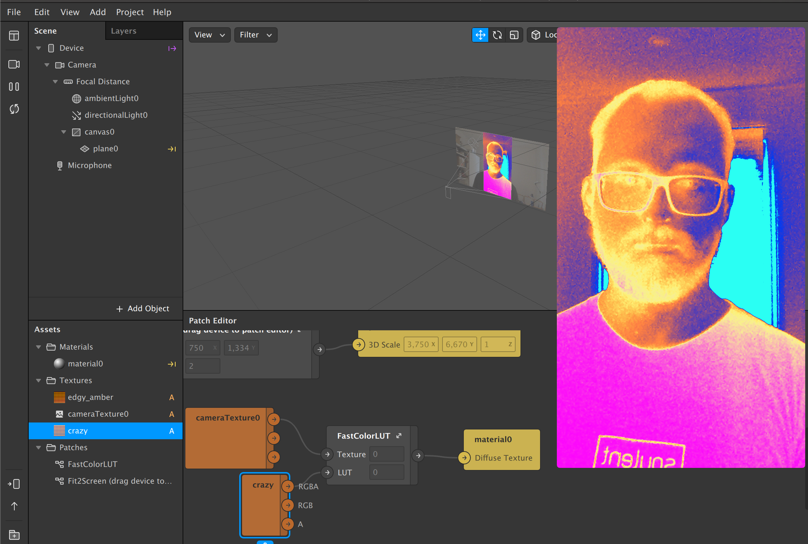

## spark-lut-tutorial

How to use the color LUT patch and create your own custom LUTs.

[Tutorial on YouTube](https://www.youtube.com/watch?v=lxF-ecbkbr4)

https://github.com/positlabs/spark-fit2screen

https://github.com/positlabs/spark-lut-patch
